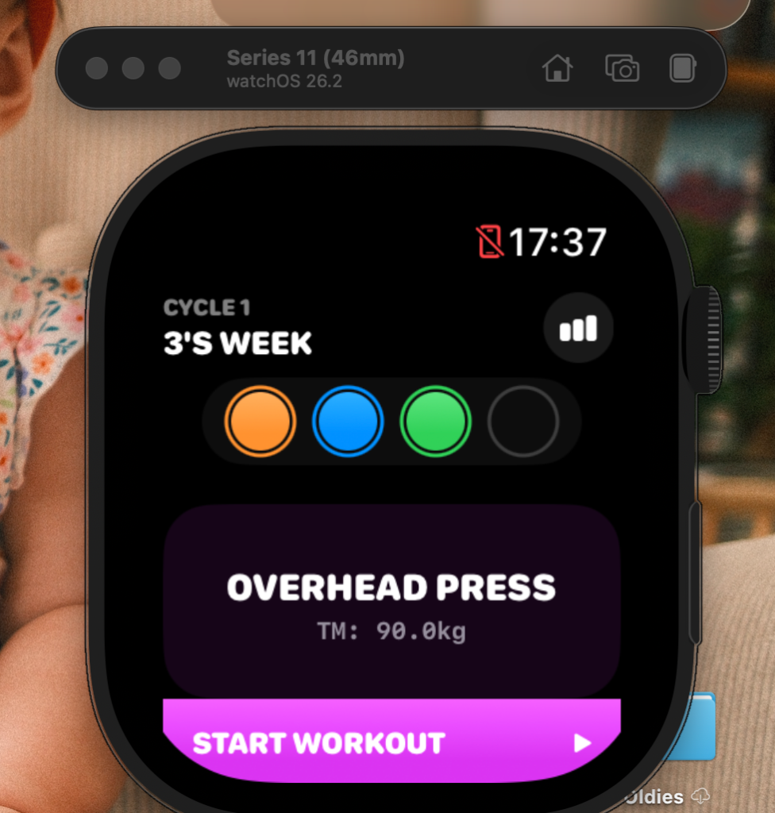

# IronFive UX/UI Deep Review

> Reviewed as a watchOS design expert and dedicated 5/3/1 lifter.

---

## 📸 Screenshot Analysis

### Dashboard (Screenshot 4)



**What works well:**
- Clean hierarchy: Cycle → Week → Progress → Next Lift → CTA
- Color-coded lift progress rings are distinctive — icons now visible ✅
- The "START WORKOUT" button is bold and unmissable

**What needs improvement:**

| Issue | Impact |
|-------|--------|
| No today's workout preview (sets × reps × weight) | User must START to see what's coming |
| No template indicator (FSL/BBB/SSL) shown | User doesn't know their template at a glance |
| No total set count for the session | Can't estimate workout duration |
| Settings/gear icon missing from dashboard | Must navigate elsewhere to change settings |
| "BEST E1RM" stat only shows for lifts with history | New users see empty space |
| "OTHER" button label is vague | Should say "Change Lift" or use a swap icon |

### Warmup Screens (Screenshots 1 & 3)

**What works well:**
- Weight and reps are large and readable mid-set
- Percentage badge (40%, 50%) gives useful context
- Heart rate and timer footer is helpful

**What needs improvement:**

| Issue | Impact |
|-------|--------|
| **No lift name visible** — just "WARMUP" | Which lift am I warming up? Critical when supersetting |
| **Set/rep indicators (1/3 SET) are missing or clipped** | User doesn't know position in the phase |
| **SKIP button invisible** in warmup screens | Must swipe to navigate, no explicit skip |
| No "next set preview" | User can't mentally prepare for the upcoming weight |
| Percentage badge is subtle | Could be more prominent as it's key 5/3/1 info |

### Main Set Screen (Screenshot 2)

**What works well:**
- "MAIN" label distinguishes from warmup
- 70% badge is visible
- Weight (62.5kg) and reps (3) are clear

**What needs improvement:**

| Issue | Impact |
|-------|--------|
| **No AMRAP indicator** on the 3+ set | The "+" is the most important part of 5/3/1! |
| No PR goal badge visible | Should show "GOAL: X REPS" on AMRAP sets |
| The completion circle is generic gray | Should pulse or glow on AMRAP sets to signal importance |
| Still no lift name in header | |

### Completion Screen (Screenshot 5)

**What works well:**
- Trophy icon and "GREAT JOB!" is motivating
- Shows cycle/week context
- Energy + HR + time stats visible in footer

**What needs improvement:**

| Issue | Impact |
|-------|--------|
| Stats are half-clipped at bottom | Total weight lifted and detailed stats truncated |
| No AMRAP result shown | The single most important data point of the session is hidden |
| No E1RM comparison | Should show "New E1RM: X kg (+Y)" |
| "FINISH" button likely below fold | User must scroll to find it |

---

## 🏗 Dashboard — Enrichment Recommendations

The Dashboard is the "home screen" — the user glances at it before every workout. It should answer:

1. **What am I doing today?** → Lift name + template
2. **What does today's workout look like?** → Key sets preview
3. **Where am I in my program?** → Cycle/week/progress
4. **How am I progressing?** → E1RM trend or streak

### Proposed Dashboard Additions

#### A. Today's Workout Preview Card
Show a compact preview of the workout structure below the lift card:

```
┌─────────────────────────────┐
│  🔥 WARMUP    3 sets        │
│  💪 MAIN      3 sets (AMRAP)│
│  📦 FSL       5 × 5         │
│  🏋 ACCESSORIES  2 exercises │
│                             │
│  ≈ 14 total sets            │
└─────────────────────────────┘
```

This gives the lifter mental preparation and expectation-setting.

#### B. Template Badge
Add the active template name near the cycle header:

```
CYCLE 1 · FSL
3'S WEEK
```

#### C. Streak Counter
Show consecutive workout days or sessions completed:

```
🔥 4-day streak
```

#### D. Quick TM Overview
Below the next lift card, show all four TMs in a compact row so the user can see their numbers at a glance without entering settings:

```
S: 120  B: 90  D: 140  O: 60
```

---

## 🎯 Workout Flow — Critical UX Improvements

### 1. Always Show the Lift Name (Critical)
The header currently says "WARMUP" or "MAIN" but **never shows which lift**. When mid-workout, brain fatigued, the user needs to see:

```
🏋 SQUAT — WARMUP    (not just "WARMUP")
```

**Recommendation:** Combine the lift icon + short name with the phase:
```swift
// In header: show lift initial + phase
Text("\(lift.name.prefix(1)). \(step.title)")
```

Or simply show the lift icon (which we already have) — but ensure the icon is visually distinct enough to convey the lift type without text.

### 2. AMRAP Set Must Be Visually Different (Critical)
The AMRAP set is the **single most important set** in 5/3/1. It determines your progression. Currently it looks identical to regular main sets.

**Recommendations:**
- Orange/gold pulsing border around the set card
- Large "AMRAP" badge replacing the percentage badge
- The completion circle should glow orange instead of green
- Show the PR goal prominently: "BEAT: 8 REPS"

### 3. Set Progress Must Always Be Visible (High)
The "1/3 SET" indicator and SKIP button are completely missing from Screenshots 1–3. This likely means the bottom section is clipped by the Apple Watch's curved display.

**Recommendations:**
- Reduce the height of the `SetRowView` card (currently `padding(.vertical, 8)`)
- Move set progress ABOVE the weight card, not below
- Or integrate it into the header bar

### 4. Next Set Preview (Medium)
After completing a set, before the rest timer, briefly show what's coming next:

```
NEXT: 50.0 kg × 5 reps
```

This is especially useful during warmups where weights change every set.

---

## 🎨 Visual Design Improvements

### 1. Color Strategy
Currently the entire workout screen is monochrome (dark gray on black). The only color is in the header icon and the green completion button.

**Recommendations:**
- Use the lift's color as a subtle accent throughout:
  - Tint the percentage badge border with the lift color
  - Apply a very subtle gradient background using the lift color (5% opacity)
  - Color the "REPS" text with the lift color

### 2. Typography Hierarchy
The weight (45.0 kg) and reps (5 REPS) use similar visual weight, making it hard to distinguish at a glance.

**Recommendations:**
- Make weight MUCH larger (current: 26pt → suggested: 32pt)
- Make reps smaller but color-coded (current: 16pt gray → suggested: 14pt with lift color)
- The "kg" unit label should be even smaller (8pt)

### 3. Completion Circle
The generic gray circle doesn't communicate what it does.

**Recommendations:**
- Add a subtle "TAP" label inside when uncompleted
- On AMRAP sets, make the circle orange with a "+" inside
- After completion, animate a satisfying ring-fill with particles (already partially done)

### 4. Progress Bar Enhancement
The green progress bar at the top is thin and easily missed.

**Recommendations:**
- Make it slightly thicker (3pt → 4pt)
- Color-code segments: orange for warmup progress, lift-color for main, gray for supplemental
- Add a percentage text: "45% DONE"

---

## 📊 Information Architecture

### Missing Data Points on Dashboard

| Data Point | Where to Source | User Value |
|-----------|----------------|------------|
| Active template (FSL/BBB) | `profile.selectedTemplate` | Know what supplemental work awaits |
| Today's estimated total sets | Calculate from `WorkoutCalculator` | Estimate workout duration |
| Last workout date | `workoutSessions.first?.date` | Know when you last trained |
| Current streak | Count consecutive sessions | Motivation |
| All four TMs at a glance | `profile.squatTM` etc. | Quick reference |
| Week progression visual | Current week in 3/4 week context | Big-picture orientation |

### Missing Data Points in Workout

| Data Point | Where to Source | User Value |
|-----------|----------------|------------|
| Lift name in header | `lift.name` | Know which exercise |
| Plate breakdown hint | Already have `PlateCalculatorView` | Quick plate math |
| Set position (1/3) | Already computed | Know position |
| Rest time recommendation | Could vary by set type | Optimal recovery |

---

## 🔧 Quick Wins (Implementable in < 1 hour each)

1. **Add template badge to dashboard header** → 1 line of code
2. **Show lift initial in workout header** → small edit to header HStack
3. **Add "last trained" date to dashboard** → query most recent session
4. **Increase AMRAP visual prominence** → orange border + pulsing animation
5. **Add "≈N sets" to dashboard card** → simple count calculation
6. **Add Settings gear icon to dashboard** → NavigationLink to SettingsView
7. **Rename "OTHER" button** → "CHANGE LIFT" or use `arrow.triangle.2.circlepath` icon

---

## 📱 Apple Watch HIG Compliance Notes

| Guideline | Current Status | Recommendation |
|-----------|---------------|----------------|
| Content should avoid screen edges | ⚠️ Bottom content clips | Add safe area padding |
| Use Digital Crown for input | ✅ Used in AMRAP input | Good |
| Minimize text, maximize glanceable info | ⚠️ Some screens text-heavy | Use more icons |
| Support Always-On Display | ❓ Not verified | Add `.always` redaction |
| Haptic feedback for actions | ✅ Well implemented | Good |
| Navigation depth ≤ 3 levels | ✅ Dashboard → Workout → Summary | Good |

---

## 🎖 Priority Matrix

### 🔴 Critical (Do First)
1. Fix set progress and SKIP button clipping
2. Show lift name/icon clearly in workout header
3. Make AMRAP sets visually distinct

### 🟠 High Priority
4. Add today's workout preview to Dashboard
5. Show template name on Dashboard
6. Show AMRAP result and E1RM on completion screen

### 🟡 Medium Priority
7. Add Settings access from Dashboard
8. Show "last trained" date
9. Improve typography hierarchy in SetRowView
10. Add next-set preview after completion

### 🟢 Nice to Have
11. Streak counter
12. Compact TM overview on Dashboard
13. Multi-segment colored progress bar
14. Always-On Display support
